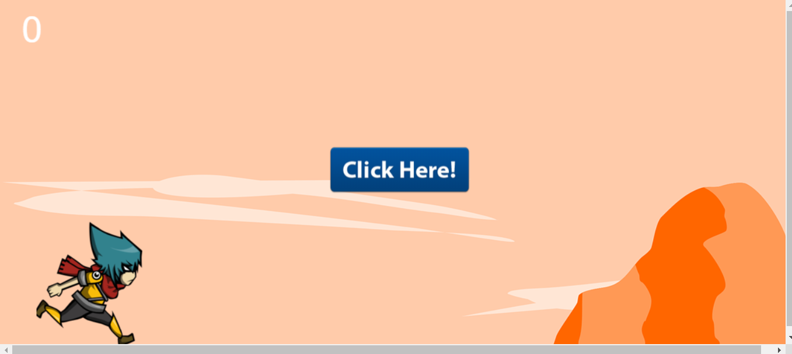

# JOGO DO CANVAS
☑️JOGO EM HTML/CSS/JS.

 <br> 

## DESCRIÇÃO:
Este é um jogo simples usando o elemento canvas do HTML5 e JavaScript. Aqui está uma visão geral:

- O jogo tem três estados principais: "jogar", "jogando" e "perdeu", que são definidos no objeto `estados`.
- O jogo começa no estado "jogar", onde é exibida uma tela de início.
- Quando o jogador clica no canvas, o evento de clique é capturado e manipulado pela função `clique()`.
- Dependendo do estado atual do jogo, diferentes ações são realizadas quando o jogador clica.
- O jogo é atualizado e renderizado continuamente em um loop usando a função `roda()` e `window.requestAnimationFrame()`.
- Os objetos do jogo, como o personagem (samurai), as pedras (pedras), o chão (chao) e o fundo (bg), são desenhados na tela de acordo com o estado atual do jogo.
- A pontuação do jogador é exibida na tela e atualizada conforme o jogo progride.

## COMO USAR?
* Clone o repositório para o seu sistema local:

```bash
git clone https://github.com/VILHALVA/JOGO-DO-CANVAS.git
```

* Navegue até o diretório do projeto.

```bash
cd JOGO-DO-CANVAS
```

* Descompacte o arquivo ZIP (se você baixou manualmente):

```bash
unzip JOGO-DO-CANVAS.zip
```
* Abra o arquivo `index.html` em seu navegador de preferência.

## NÃO SABE?
- Entendemos que para manipular arquivos em `HTML`, `CSS` e outras linguagens relacionadas, é necessário possuir conhecimento nessas áreas. Para auxiliar nesse aprendizado, oferecemos cursos gratuitos disponíveis:
* [Curso de HTML e CSS](https://github.com/VILHALVA/CURSO-DE-HTML-E-CSS)
* [Curso de JavaScript](https://github.com/VILHALVA/CURSO-DE-JAVASCRIPT)
* [Confira mais cursos](https://github.com/VILHALVA?tab=repositories&q=+topic:CURSO)

## CREDITOS:
- [PROJETO CRIADO PELO "gustavoSoriano"](https://github.com/gustavoSoriano/game-canvas)
- [PROJETO EDITADO PELO VILHALVA](https://github.com/VILHALVA)
- [ESTÁ DISPONIVEL NO SITE](https://vilhalva.github.io/STYLER/STYLER.html)